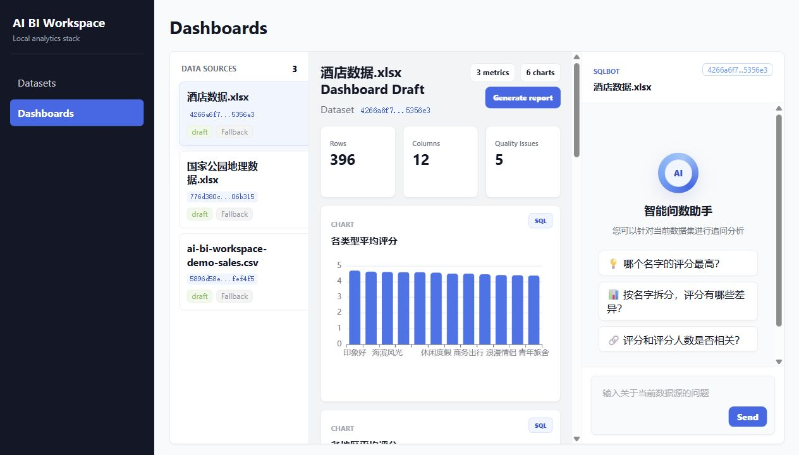
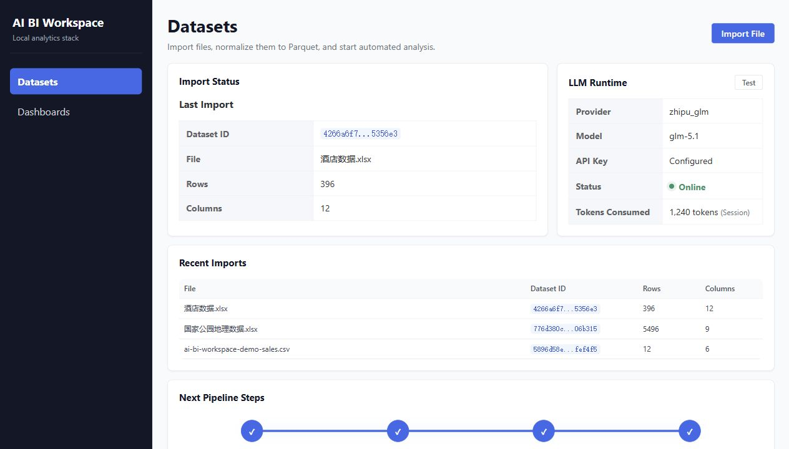

# AI BI Workspace

AI BI Workspace is a local-first, AI-assisted data analysis workspace. It turns
CSV, Excel, and JSON files into profiled Parquet datasets, generates dashboard
cards automatically, proposes cleaning operations, and adds a SQLBot-style chat
panel for follow-up analysis.

The project is built around FastAPI, Vue 3, DuckDB, Parquet, ECharts, and
OpenAI-compatible LLM providers, with a Tremor-inspired analytical dashboard UI.
It is designed as a lightweight personal BI workspace that can run locally
without a database service.

## UI Preview

### Dashboard Workspace

The dashboard view combines dataset selection, KPI cards, generated ECharts
visualizations, report generation, and an AI question-answering panel in one
workbench.



### Dataset Pipeline

The datasets view shows import status, LLM runtime health, pipeline progress,
profile summaries, quality issues, cleaning previews, and recent imports.



## Highlights

- **One-click file analysis**: import CSV, Excel, or JSON and automatically
  normalize it into Parquet.
- **Automatic profiling**: infer schema, detect nulls, duplicates, probable
  identifiers, constant columns, and other quality issues.
- **AI-assisted dashboard generation**: produce a chart plan and ECharts-ready
  dashboard cards from the dataset profile.
- **SQLBot ChatBI**: ask natural-language questions over the current dataset and
  execute safe read-only DuckDB SQL over Parquet.
- **Dynamic suggested questions**: generate dataset-specific starter questions
  with the configured LLM, with a deterministic profile-based fallback.
- **Cleaning workflow**: preview and execute cleaning operations as a new dataset
  version.
- **Tremor-style workspace UI**: use a dense analytical layout with clean KPI
  cards, chart panels, data tables, and a focused ChatBI sidebar.
- **Runtime monitoring**: inspect LLM provider configuration, online status, and
  session token usage in the UI.
- **Local artifact storage**: keep raw files, Parquet datasets, dashboard specs,
  reports, chat history, and jobs under `storage/`.

## Feature Matrix

| Area | Current support |
| --- | --- |
| Import | CSV, Excel, JSON |
| Storage | Local raw files and Parquet warehouse |
| Profiling | Schema, completeness, uniqueness, quality issues |
| Cleaning | Plan, preview, execute as a new version |
| Dashboard | KPI cards and generated ECharts visualizations |
| Charts | Bar, line, area, heatmap, scatter, pie, treemap, boxplot, bullet |
| ChatBI | LLM SQL planning, DuckDB execution, Markdown answer rendering |
| Suggested questions | LLM-generated per dataset with profile fallback |
| Jobs | Local JSON-backed import, cleaning, and report jobs |
| Reports | LLM-generated BI report with deterministic fallback |

## Tech Stack

| Layer | Technology |
| --- | --- |
| Backend | FastAPI, Pydantic, pandas |
| Analytical engine | DuckDB over Parquet |
| File formats | CSV, Excel, JSON, Parquet |
| Frontend | Vue 3, TypeScript, Vite |
| UI and charts | Element Plus, ECharts, Tremor-inspired Vue styling |
| LLM | OpenAI-compatible chat completions API |
| Storage | Local filesystem artifacts under `storage/` |

## Repository Layout

```text
backend/      FastAPI app, routes, use cases, infrastructure services, tests
frontend/     Vue 3 dashboard and dataset management UI
docs/         Architecture notes and roadmap
storage/      Runtime artifact folders; contents are ignored by Git
pyproject.toml
```

## Requirements

- Python 3.11 or 3.12
- Node.js 20+
- npm 10+
- An OpenAI-compatible LLM API key if you want AI planning, reports, and ChatBI
  suggestions

No database service is required for the current file-based MVP.

## Quick Start

### 1. Clone and configure

```powershell
git clone https://github.com/<your-org>/ai-bi-workspace.git
cd ai-bi-workspace
copy .env.example .env
```

Edit `.env` and set your LLM provider values:

```env
LLM_PROVIDER="zhipu_glm"
LLM_BASE_URL="https://open.bigmodel.cn/api/paas/v4"
LLM_API_KEY="your-api-key"
LLM_MODEL="glm-5.1"
```

Any OpenAI-compatible provider can be used by setting `LLM_PROVIDER` to
`openai_compatible` and pointing `LLM_BASE_URL` to the provider's `/v1` base URL.

### 2. Start the backend

```powershell
python -m venv .venv
.\.venv\Scripts\Activate.ps1
python -m pip install -e ".[dev]"
python -m uvicorn backend.main:app --host 127.0.0.1 --port 8000 --reload
```

Backend API docs are available at:

```text
http://127.0.0.1:8000/docs
```

### 3. Start the frontend

```powershell
cd frontend
npm install
npm run dev
```

Open:

```text
http://127.0.0.1:5173
```

## Configuration

| Variable | Default | Description |
| --- | --- | --- |
| `PROJECT_NAME` | `AI Powered Data Analyst` | FastAPI application title |
| `API_V1_PREFIX` | `/api/v1` | API prefix |
| `STORAGE_ROOT` | `./storage` | Local artifact root |
| `LLM_PROVIDER` | `openai_compatible` | `openai_compatible` or `zhipu_glm` |
| `LLM_BASE_URL` | `https://api.openai.com/v1` | Chat completions base URL |
| `LLM_API_KEY` | empty | Provider API key |
| `LLM_MODEL` | `gpt-4.1-mini` | Model name sent to the provider |

## API Overview

All routes are mounted under `/api/v1`.

| Area | Routes |
| --- | --- |
| Health | `GET /health` |
| Datasets | `GET /datasets`, `POST /datasets/import/file`, `POST /datasets/import/file/job` |
| Dataset artifacts | `GET /datasets/{dataset_id}/versions/{version_id}/profile`, `/analysis`, `/preview` |
| Cleaning | `GET /cleaning-plan`, `POST /cleaning-preview`, `POST /cleaning-execute`, `POST /cleaning-execute/job` |
| Dashboards | `GET /dashboards`, `GET /dashboards/by-dataset/{dataset_id}/versions/{version_id}` |
| Reports | `POST /dashboards/by-dataset/{dataset_id}/versions/{version_id}/report/job` |
| ChatBI | `GET/POST/DELETE /chat/datasets/{dataset_id}/versions/{version_id}/messages` |
| Suggestions | `GET /chat/datasets/{dataset_id}/versions/{version_id}/suggestions` |
| LLM | `GET /llm/config`, `GET /llm/health` |
| Jobs | `GET /jobs`, `GET /jobs/{job_id}` |

## Development Commands

Backend:

```powershell
python -m pytest backend\tests -q
python -m ruff check backend
```

Frontend:

```powershell
cd frontend
npm run typecheck
npm run build
```

## Runtime Data

Uploaded files, Parquet datasets, generated dashboards, reports, chat history,
and job records are written under `storage/`. These files are runtime artifacts
and are ignored by Git:

```text
storage/raw/
storage/warehouse/
storage/jobs/
storage/exports/
storage/tmp/
```

The repository keeps `.gitkeep` files so these directories exist after cloning.

## Security Notes

- Do not commit `.env` or API keys.
- ChatBI SQL generation is constrained to read-only DuckDB queries over the
  active Parquet dataset.
- This project is designed for local/private data analysis. Add authentication,
  authorization, quotas, and audit logging before exposing it to a network.

## Roadmap

See [docs/ROADMAP.md](docs/ROADMAP.md).

## Contributing

Issues and pull requests are welcome. For code changes, please include focused
tests when the behavior changes and run the backend and frontend verification
commands before opening a pull request.

## License

MIT. See [LICENSE](LICENSE).
